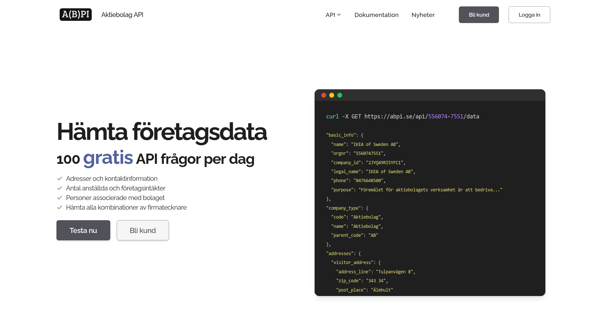

# ABPI Puplic Repository
Official public repository for ABPI. \
Visit https://abpi.se or https://abpi.nu for more information. \
API documentation: https://abpi.se/docs

<kbd>

</kbd>

## SDKs

* [<strong>Python</strong> SDK](sdk/python) (beta)
* <strong>C#</strong> SDK (wip)

---

* ##### [Releases](../../releases)
* ##### [Issue tracker](../../issues)
* ##### [Feature requests](../../issues)
* ##### [License](LICENSE.md)

---

<strong>ABPI.se</strong> | Gör din app smartare med uppdaterad företagsdata.
